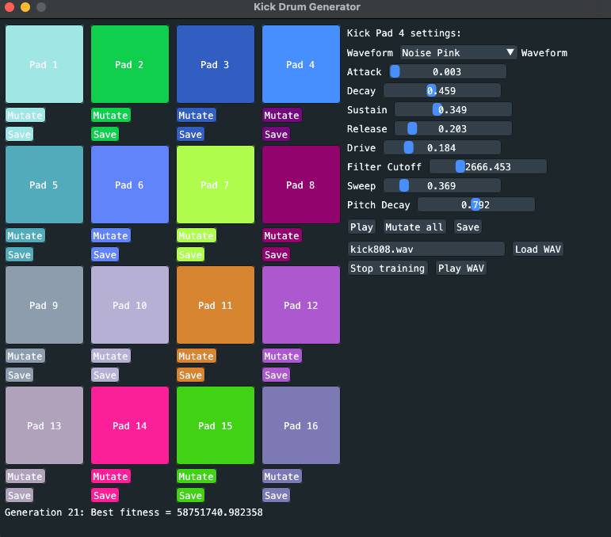

# Kick

This is a Go package, command line utility and GUI program for generating kick drum audio samples.

Note that the project is a bit experimental, a work in progress and that the generated samples aren't quite right, yet.



## Contents

- A Go package for generating kick drum samples with a wide variety of parameters.
- A command-line utility for generating kick drum samples (`cmd/kick`).
- A GUI that allows the user to tweak synth settings and also evolve settings closer to a given audio sample using genetic algorithms (`cmd/mutator`).

## Requirements

* `go` for building the executables.
* `mpv` or `ffmpeg` for playing the generated samples, when using `cmd/kick` or `cmd/mutator`.

## Installation

```sh
go install github.com/xyproto/kick/cmd/kick@latest
go install github.com/xyproto/kick/cmd/mutator@latest
```

## Usage

### Command-line Utility

Generate a kick drum inspired by the Roland TR-808 drum machine:

```bash
kick --808 -o kick808.wav
```

You can customize various parameters like the waveform, attack, decay, and more:

```bash
kick --waveform 0 --attack 0.005 --decay 0.3 --release 0.2 --drive 0.4 --o custom_kick.wav
```

Available drum machine styles:

- `--606` for 606-style kicks.
- `--707` for 707-style kicks.
- `--808` for 808-style kicks.
- `--909` for 909-style kicks.
- `--linn` for LinnDrum-style kicks.
- `--experimental` for unique and experimental sounds.
- `--deephouse` for deep house kicks.

## Audio Samples

A few generated samples can be found in the `samples/` directory. They include both `.wav` and `.mp4` formats to showcase the sounds in GitHub's README.

## General info

* License: MIT
* Version: 1.8.1
